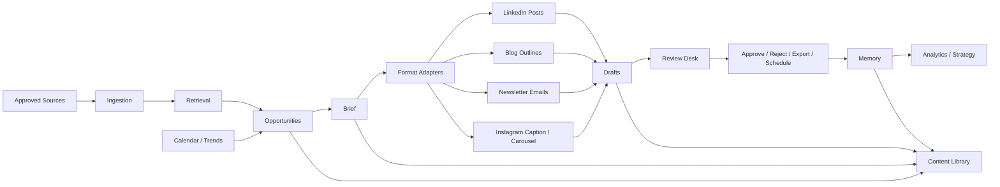

# Quainy Vouch

Quainy Vouch is a production-first, source-grounded content intelligence product for turning approved company knowledge into human-reviewed public communication.

It helps teams move from approved context to reviewable LinkedIn-style company drafts, blog outlines, newsletter emails, and Instagram captions/carousels without handing a tool broad internal access or allowing autonomous publishing.

## What Works Today

The current codebase contains a deterministic prototype foundation:

- approved source ingestion
- sample company profile and voice rules
- signup, login, authenticated current workspace, and onboarding progress
- source-backed opportunity generation
- platform-independent briefs
- LinkedIn-style draft variants
- blog outline variants from the same brief
- newsletter email variants from the same brief
- Instagram caption and carousel variants from the same brief
- claim, risk, quality, freshness, and duplicate metadata
- review desk with edit, approve, reject with reason, regenerate, export/copy, and manual scheduling
- local LinkedIn publishing adapter with selected page metadata, provider result storage, and audited failure handling
- approved/exported/published memory, similar-post warnings, analytics import, and manual metrics fallback
- local workspace users with owner, editor, reviewer, and viewer roles
- approval chains with required reviewer count and audited risk overrides
- preference learning suggestions from edits and rejections, with user-approved profile updates
- company/public calendar events, industry trend signals, and relevance-gated trend opportunities
- durable content library and strategy dashboard with pillar coverage, topic repetition, platform/content-type performance, and suggested next directions
- PostgreSQL/pgvector runtime target with Alembic-managed persistence for signup, sessions, organization profile, onboarding, source knowledge, generated artifacts, reviews, memory, and audit logs

This prototype is intentionally deterministic. It now includes the first production onboarding path and the first persistent storage path, while live model-provider adapters remain later hardening steps.

The production product must start from each user's own organization. Seeded Quainy data, deterministic providers, and local fixtures are development aids only; they are not part of the intended production experience.

## Quickstart

Copy the local environment template:

```bash
cp .env.example .env
```

Install and run the backend:

```bash
uv sync --extra dev
uv run uvicorn app.main:app --reload --app-dir backend
```

Install and run the frontend:

```bash
cd frontend
npm install
npm run dev
```

Open `http://localhost:5173`.

The API runs at `http://127.0.0.1:8000`.

See [Open-Source Quickstart](./docs/quickstart.md) for the full first-draft flow.

## Project Docs

- [Open-Source Quickstart](./docs/quickstart.md)
- [Security Notes](./docs/security.md)
- [Backup And Restore Guide](./docs/backup_restore.md)
- [Frontend Production Requirements](./docs/product/frontend_production_requirements.md)
- [Production Readiness Checklist](./docs/product/production_readiness_checklist.md)
- [System Overview](./docs/architecture/system_overview.md)
- [Contributing](./CONTRIBUTING.md)
- [Architecture API Schema](./docs/architecture/api_schema.yaml)
- [Architecture Database Schema](./docs/architecture/database_schema.sql)
- [Module Interfaces](./docs/architecture/module_interfaces.md)
- [LinkedIn API Research](./docs/integrations/linkedin_api_research.md)
- [Prototype Evaluation Log](./docs/evaluation/quainy_dogfood_log.md)
- [MVP Bug List](./docs/evaluation/mvp_bug_list.md)
- [Evaluation Regression Reports](./docs/evaluation/regression_reports.md)

## Docker Compose

```bash
docker compose up --build
```

The Compose setup starts Postgres with pgvector, the backend, and the frontend. By default, Compose uses `QUAINY_DATA_BACKEND=postgres` and keeps development seeding off.

Database schema changes run through Alembic at backend startup. The baseline migration is in `backend/migrations/versions/202607110001_initial_schema.py`.

## Tests

```bash
uv run pytest -q
```

```bash
cd frontend
npm run build
```

Run the deterministic MVP evaluation harness:

```bash
uv run python scripts/run_eval.py
```

## Development Fixtures

The current backend can seed a Quainy workspace during development with:

- organization profile
- voice rules
- preferred and banned phrases
- approved and forbidden claims
- content pillars
- approved sample context

This lets a developer generate source-backed draft variants without model keys or external integrations. Production onboarding must not rely on this seeded workspace.

Fixture controls:

- `QUAINY_FIXTURE_MODE=none` disables deterministic sample data.
- `QUAINY_FIXTURE_MODE=sample` enables the seeded sample workspace for local memory-mode testing.
- `QUAINY_ENABLE_DEV_SEED=true` is supported only as a legacy development alias.
- `QUAINY_ENV=production` blocks deterministic fixtures even if a seed flag is set.

## Current Architecture



## Current Boundaries

- No live LinkedIn OAuth or external API publishing by default.
- Local LinkedIn publishing adapter is deterministic and credential-free.
- No broad internal workspace crawling.
- No live model calls.
- Trends cannot become usable briefs unless they connect to approved company context.
- No hidden data collection.
- Seeded data comes from a small public sample context in `backend/app/sample_data.py`.

## Provider Configuration

The current deterministic prototype defaults to:

- `QUAINY_MODEL_PROVIDER=deterministic`
- `QUAINY_EMBEDDING_PROVIDER=local_hash`

An optional OpenAI model provider adapter is available behind the provider factory. It is not required for deterministic tests. To use it later, install the optional OpenAI SDK in your environment and configure:

```bash
QUAINY_MODEL_PROVIDER=openai
OPENAI_API_KEY=...
OPENAI_MODEL=gpt-4.1-mini
```

## Roadmap Direction

1. Persistent storage for organizations, profiles, sources, chunks, memory, and audit logs.
2. Automated evaluation harness and regression reports.
3. Real model provider adapters behind the existing provider interfaces.
4. Stronger source-span claim grounding.
5. Additional source connectors and format adapters.

## License

Apache-2.0. See [LICENSE](./LICENSE).
