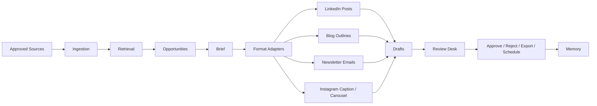

# Quainy Vouch

Quainy Vouch is a local-first, source-grounded content intelligence product for turning approved company knowledge into human-reviewed public communication.

It helps teams move from approved context to reviewable LinkedIn-style company drafts, blog outlines, newsletter emails, and Instagram captions/carousels without handing a tool broad internal access or allowing autonomous publishing.

## What Works Today

The current codebase contains a deterministic local MVP:

- approved source ingestion
- Quainy company profile and voice rules
- source-backed opportunity generation
- platform-independent briefs
- LinkedIn-style draft variants
- blog outline variants from the same brief
- newsletter email variants from the same brief
- Instagram caption and carousel variants from the same brief
- claim, risk, quality, freshness, and duplicate metadata
- review desk with edit, approve, reject with reason, regenerate, export/copy, and manual scheduling
- approved/exported memory and similar-post warnings
- seeded Quainy sample workspace

This prototype is intentionally deterministic. It proves the trust workflow before live model-provider adapters are introduced.

## Quickstart

Copy the local environment template:

```bash
cp .env.example .env
```

Install and run the backend:

```bash
uv sync --extra dev
uv run uvicorn app.main:app --reload --app-dir backend
```

Install and run the frontend:

```bash
cd frontend
npm install
npm run dev
```

Open `http://localhost:5173`.

The API runs at `http://127.0.0.1:8000`.

See [Open-Source Quickstart](./docs/quickstart.md) for the full first-draft flow.

## Project Docs

- [Open-Source Quickstart](./docs/quickstart.md)
- [Security Notes](./docs/security.md)
- [System Overview](./docs/architecture/system_overview.md)
- [Contributing](./CONTRIBUTING.md)
- [Architecture API Schema](./docs/architecture/api_schema.yaml)
- [Architecture Database Schema](./docs/architecture/database_schema.sql)
- [Module Interfaces](./docs/architecture/module_interfaces.md)
- [LinkedIn API Research](./docs/integrations/linkedin_api_research.md)
- [Quainy Dogfood Evaluation](./docs/evaluation/quainy_dogfood_log.md)
- [MVP Bug List](./docs/evaluation/mvp_bug_list.md)
- [Evaluation Regression Reports](./docs/evaluation/regression_reports.md)

## Docker Compose

```bash
docker compose up --build
```

The Compose setup starts the backend and frontend. PostgreSQL, pgvector, queues, and live model adapters are later hardening steps.

## Tests

```bash
uv run pytest -q
```

```bash
cd frontend
npm run build
```

Run the deterministic MVP evaluation harness:

```bash
uv run python scripts/run_eval.py
```

## Seeded Sample Data

The backend seeds a Quainy workspace at startup with:

- organization profile
- voice rules
- preferred and banned phrases
- approved and forbidden claims
- content pillars
- approved sample context

This lets a new developer generate source-backed draft variants without model keys or external integrations.

## Current Architecture



## Current Boundaries

- No automated LinkedIn publishing.
- No broad internal workspace crawling.
- No live model calls.
- No hidden data collection.
- Seeded data comes from a small public sample context in `backend/app/sample_data.py`.

## Provider Configuration

The local MVP defaults to deterministic providers:

- `QUAINY_MODEL_PROVIDER=deterministic`
- `QUAINY_EMBEDDING_PROVIDER=local_hash`

An optional OpenAI model provider adapter is available behind the provider factory. It is not required for tests or local dogfood. To use it later, install the optional OpenAI SDK in your environment and configure:

```bash
QUAINY_MODEL_PROVIDER=openai
OPENAI_API_KEY=...
OPENAI_MODEL=gpt-4.1-mini
```

## Roadmap Direction

1. Persistent storage for organizations, profiles, sources, chunks, memory, and audit logs.
2. Automated evaluation harness and regression reports.
3. Real model provider adapters behind the existing provider interfaces.
4. Stronger source-span claim grounding.
5. Additional source connectors and format adapters.

## License

Apache-2.0. See [LICENSE](./LICENSE).
