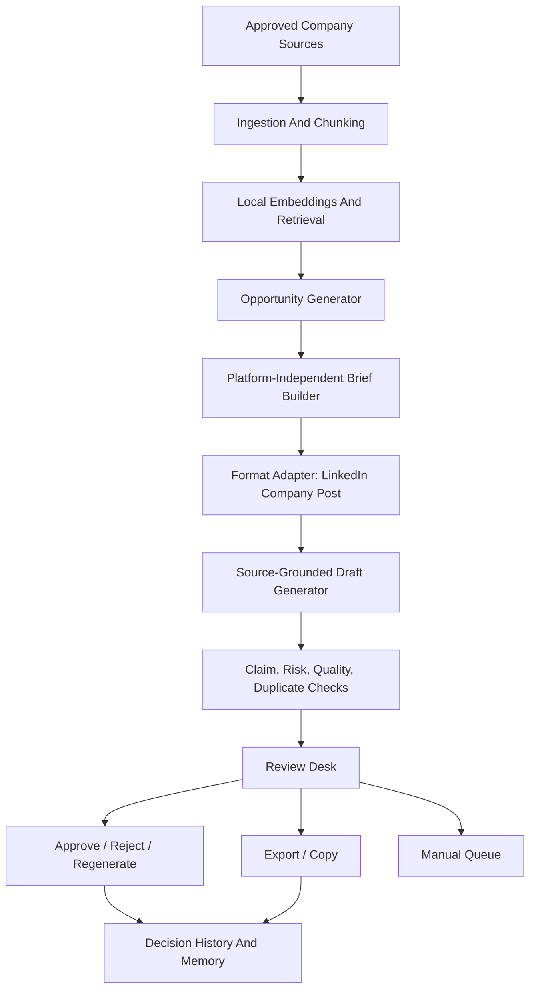

# System Overview

Quainy Vouch is a source-grounded company communication workflow. It turns approved company knowledge into reviewable platform-specific drafts while keeping source control, risk checks, and human decisions visible.

## Backend Modules

- `backend/app/source_connectors.py`: manual, text, and markdown source extraction.
- `backend/app/providers.py`: deterministic local embedding provider.
- `backend/app/prompt_registry.py`: prompt version registry for generated artifacts.
- `backend/app/opportunities.py`: source-backed opportunity generation, relevance, and freshness.
- `backend/app/briefs.py`: platform-independent content briefs.
- `backend/app/format_adapters.py`: LinkedIn company post rules and rendering.
- `backend/app/drafts.py`: source-grounded draft generation.
- `backend/app/risk_checks.py`: claim grounding, risk checks, approval blocking helpers.
- `backend/app/store.py`: local in-memory workspace, audit, memory, and queue behavior.
- `backend/app/main.py`: FastAPI routes.

## Frontend Areas

- setup and voice profile
- source library and retrieval inspector
- opportunities
- brief panel
- draft variants
- review desk
- similar memory and evidence
- manual queue

## Current Persistence

The MVP uses an in-memory store seeded at backend startup. Schema drafts are maintained in `docs/architecture/database_schema.sql` for the future persistent implementation.

## Extension Points

- Source connectors
- Format adapters
- Model providers
- Embedding providers
- Evaluators
- Persistent repositories
